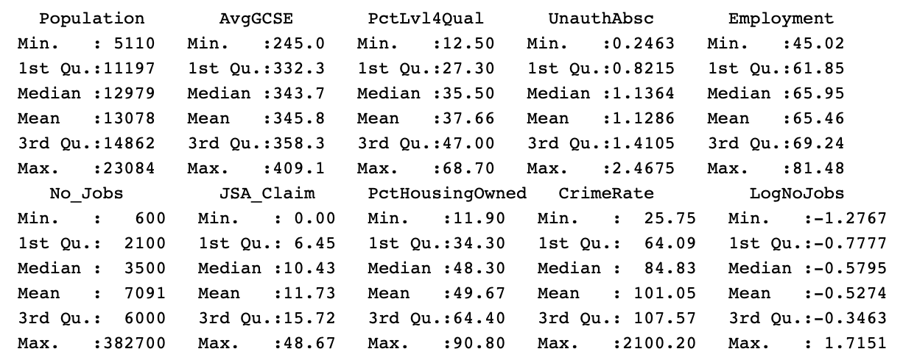

# Part 1 -  Presentation and Critical Evaluation of Maps Produced Using Different Software Packages


### Qgis Map:

```{r echo = FALSE, warning = FALSE, message = FALSE, results ='asis'}
knitr::include_graphics("Part_1/Part1MegacitiesMap.png")
```


### R Map:


```{r echo = FALSE, warning = FALSE, message = FALSE, results ='asis'}
#Read in CSV Files
UrbanSlumsPop <- read.csv("Part_1/Urban_Slums_Pop.csv", header = TRUE, sep = ",")
names(UrbanSlumsPop)[names(UrbanSlumsPop)=="Population.living.in.slums....of.urban.population.....of.urban.population."] <- "PercentUrbanPopInSlums"
MegacitiesCSV <- read.csv("Part_1/MegaCities_2035_Data.csv", header = TRUE, sep = ",")

#Read in Shapefiles
library(tidyverse)
library(plotly)
library(maptools)
library(RColorBrewer)
library(classInt)
library(sp)
library(rgeos)
library(tmap)
library(tmaptools)
library(sf)
library(rgdal)
library(geojsonio)
library(methods)
library(ggplot2)

WorldCountriesMap <- read_shape("Part_1/WC_Backup/WorldCountriesBackupSHP.shp", as.sf = TRUE)
MegacitiesMap <- read_shape("Part_1/Megacities_Part1.shp", as.sf = TRUE)

WorldCountriesMapData <- WorldCountriesMap %>% left_join(UrbanSlumsPop, by = c("GMI_CNTRY" = "Code" ))
library(tmap)
library(tmaptools)
library(jsonlite)


#leaflet
library(leaflet)
library(classInt)
library(sf)
library(sp)
library(magrittr)
library(reshape2)
library(dplyr)
library(shinyjs)
library(ggmap)
#breaks<-classIntervals(WorldCountriesMapData$PercentUrbanPopInSlums, n=5, style="jenks")
#breaks <- breaks$brks
pal <- colorBin(palette = "YlOrRd", 
                domain = WorldCountriesMapData$PercentUrbanPopInSlums, bins = 5)
MegacitiesMap <- st_as_sf(MegacitiesMap)
leaflet(WorldCountriesMapData) %>%
  setView(lng = 4.6, lat = 3.8, zoom = 2)  %>%
  addPolygons(stroke = FALSE, 
              fillOpacity = 0.8, 
              smoothFactor = 0.5,
              fillColor = ~pal(WorldCountriesMapData$PercentUrbanPopInSlums),
              popup = paste("Region: ", WorldCountriesMapData$NAME, "<br>",
                            "% of population living in slums: ", WorldCountriesMapData$PercentUrbanPopInSlums)
  ) %>%
  addProviderTiles("CartoDB.DarkMatter") %>%
  addCircles(data = MegacitiesMap, 
             ~Longitude, ~Latitude, 
             popup= paste("Megacity: ", MegacitiesMap$Urban.Aggl, "<br>",
                          "2035 Estimated Population (in millions): ", MegacitiesMap$X2035.0),
             weight = 12, 
             radius=70, 
             color="#1e7cff", 
             stroke = TRUE, 
             fillOpacity = 0.8) %>%
  addLegend("bottomright", 
            pal= pal, 
            values = ~PercentUrbanPopInSlums, 
            title = "2035 Megacities & Percent of urban pop living in slums", 
            labFormat = labelFormat(prefix = "Threshold: "),
            opacity = 0.7)
```            


## Benefits and drawbacks of GUI vs Command line generated maps

The process involved in building the same map using QGIS, a GUI-based software platform, and in R, a code-based statistics software, had its advantages and drawbacks when comparing the two softwares. Building a map in a GUI-based software was easier to practice than using code-based software. Editing the data attributes visually makes breaking down the workflow easier than using command line generated maps.  The first map was built in Qgis 3.4.0, as the GUI-based software. The advantages I saw  using the Layers tab in ArcMap was directly dragging the data, as its imported in from ArcCatalog side-tab, in addition to the map visually displaying immediately, without having to convert it frequently in command line. Another advantage about the Layers are they can manually be turned off and on in ArcMap. In R, calculating statistics has a fluid flow and can be stored as set variables for later use. Editing a small element to change the final output in a code script is easier than having to repeat a whole process in GUI-based software.

## Data sources

The goal was to build a map on a global scale. The world countries shapefile polygon data was downloaded from a reliable websource, The Database of Global Administrative Areas, a firm that “provides maps and spatial data for all countries and their sub-divisions”. Megacities data was downloaded from the United Nations population surveys database as an .xls file on total populations and projections of cities over 300k around the world. The percent of each countries’ urban population is living in slums was downloaded at ourworldindata.org, as a .csv file, from an article, “Urbanization”, by Hannah Ritchie and Roser. Most current survey data is from 2014. It is worthy to note the data on the share of urban population living in slums is missing data for good chunk of our world.


## Workflow

The process involved in building a final map visualization was broken up into three main themes: finding and importing data, cleaning the data, building the map, and finally polishing up the map visualization i.e. legends, scale bar, etc… and exporting it. The maps built, visualizes a choropleth density maps of the percent of each countries’ urban population living in slums with added layers of 2020 population spread raster layer estimates and 2035 megacities points estimates for Africa and Asia. The first step was importing the world countries vector layer shapefile to set up as base polygons. To add on, importing in the cities as a .csv file and set geometry as latitude and longitude inputs, and importing in the share of urban population living in slums as a .csv file attribute table with no geometry. Join world countries and share of urban pop living in slums. Filter out all cities > 10 million for 2035 to set as megacities estimates. Visualize world countries map with % of urban pop living in slums as the polygon fill, and project megacities population estimates of 2035 as points. 

## Assessment of Maps
The Qgis map displays the megacities as a scale to their size, rather in R, the points are manually scaled to one size. The R generated map is interactive and the user is able to click on the polygons and points to display a pop-up information tab.

## Conclusion
In conclusion, GUI-based software is visually easier to work with than command line, yet GUI-based still needs development. For example, to build a 3D map in Qgis, the 3D view plug-in cannot view the map in layout view i.e. add legend and scale-bar. Using command line, its advantage is building interactive maps, in addition to cleaning and converting large datasets.

***

# Part 2 - Scavanger Hunt Analysis


## How far did you travel?

Opened up the attribute table for the route and created new field as "Total_Distance", and set it as a float.

```{r echo = FALSE, warning = FALSE, message = FALSE}

```

After right clicking on the new field, we can calculate the geometry for Total_Distance. The distance covered was 46598.3 Meters.

```{r echo = FALSE, warning = FALSE, message = FALSE}
knitr::include_graphics("Part_2/Part2Q1b.png")
```


## How many TfL station did your route pass within 100 metres distance?

Download the London stations .xml file as a .kml file to the desktop. Open up geojson, upload the downloaded London stations .kml file, and save it as a shapefile. Add the newly downloaded shapefile to the layers tab in ArcMap.

```{r echo = FALSE, warning = FALSE, message = FALSE, results ='asis'}

```

Under geoprocessing, create a buffer around the route layer and set it at 100 meters.

```{r echo = FALSE, warning = FALSE, message = FALSE, results ='asis'}

```

```{r echo = FALSE, warning = FALSE, message = FALSE, results ='asis'}

```

After selecting by location, we can select features from the London stations points. Choose the source layer as London stations and set spatial selection are completely within the source layer feature.


```{r echo = FALSE, warning = FALSE, message = FALSE, results ='asis'}
knitr::include_graphics("Part_2/Part2Q2d.png")
```


Once the London station points are highlight that represent within 100 meters of the route, right-click the points layer and create a new layer from the selection. A new layer is added to the Layers tab. The attribute table displays the number of points as 24 stations.


```{r echo = FALSE, warning = FALSE, message = FALSE, results ='asis'}

```

## How many points did you score based on treasure hunt locations they managed to get within 300 metres of?

Treasure hunt locations were downloaded in R as a dataframe from the [source](https://www.dropbox.com/s/2cbu2ux9ddy9c0l/huntaddresses.csv?raw=1) and written as a .csv to the desktop. Add data into ArcMap as XY data and set longitude and latitude accordingly was projecting the data incorrectly onto the map, even after fixing the projection. Therefore, uploading the .csv file to geojson was necessary to export as a shapefile. The treasure hunt shapefile was added to the Layers tab and displayed as points.


```{r echo = FALSE, warning = FALSE, message = FALSE, results ='asis'}

```

```{r echo = FALSE, warning = FALSE, message = FALSE, results ='asis'}

```

Once again, repeat similar steps above to create a buffer, but with 300 meters instead of 100 meters. From selection by location, select features from TreasureHunt points, set source layer as the newly created buffer, and are completely within the buffer.

```{r echo = FALSE, warning = FALSE, message = FALSE, results ='asis'}

```

Set the selected treasure hunt locations within the buffer as a new layer. After opening up the attribute table, and selecting the points (representing scores for locations) field, the Statistics tab displays a sum of 60 points scored within 300 meters of the route.

```{r echo = FALSE, warning = FALSE, message = FALSE, results ='asis'}

```


## Which Wards did you pass through that had the (a) lowest and (b) the highest rates of Male Life Expectancy?

Select by location tab and setting the source layer as LondonWards intersecting through the route. A new layer was created from the selected wards.

```{r echo = FALSE, warning = FALSE, message = FALSE, results ='asis'}

```

The attribute table can sort fields by ascending or descending giving the ability to see the highest and lowest rates of Male Life Expectancy that are intersecting through the route. The lowest ward, Bow East, has a male life expectancy rate of 71.26 years, while West End has the highest rate of 93.21 years.

```{r echo = FALSE, warning = FALSE, message = FALSE, results ='asis'}

```


## Taking the average of all Wards that you passed through, what was the average life expectancy at birth for babies born in those wards along the whole route?

In the attribute table for the intersecting London Wards, we can highlight the Male life expectancy and Female life expectancy individually and clicking the Statistics tab to reveal the averages.

```{r echo = FALSE, warning = FALSE, message = FALSE, results ='asis'}

```

```{r echo = FALSE, warning = FALSE, message = FALSE, results ='asis'}

```

Male life expectancy has a lower average of 78.39 years compared to the average Female life expectancy rate of 85.072 years.

## Is there any spatial patterns for CASA Treasure Hunt locations or are they randomly distributed?

For a clustering analysis in ArcMap, first, a spatial join was performed between the treasure hunt locations and London wards. 

```{r echo = FALSE, warning = FALSE, message = FALSE, results ='asis'}
knitr::include_graphics("Part_2/Part2Q6a.png")
```

For this analysis, a Morans I and a Hot spot (Getis-ord Gi*) analyses were performed with results displayed below. Moran I test shows our values are clustered and a hot-spot test maps the potential clusters.

```{r echo = FALSE, warning = FALSE, message = FALSE, results ='asis'}

```

```{r echo = FALSE, warning = FALSE, message = FALSE, results ='asis'}

```

***

# Part 3 - London, UK Opportunity Index


## Introduction

  In 2009, The Kirwan Institute conducted an in-depth analysis on neighborhood opportunity for multiple cities and states in the USA. This was the first introduction into “Opportunity mapping”; the use of quantitative methods as a way to visualize and map opportunities that are experiences throughout cities and neighborhoods. Opportunity in this case can be defined as environmental (neighborhoods) conditions that determine access to resources and infrastructure that provide stability and ability to excel in society. Fair access to sustainable employment, quality education, health care, and safe and affordable housing are examples of opportunity.
  This report explores opportunity mapping for London using the Kirwan Institute’s study as a foundational model. The report will pull data representing indicators of opportunity such as:


* Educational variables:
* Economic variables:
* Neighborhood and Housing quality varibales:


The data will help explore and address the following research topics:
What does opportunity look like in London?

* Are there disparities and/or inequalities in opportunity based upon geography?


### Benefits of research

  Analyzing census themed data can provide information to municipalities or institutions that are focused on alleviating the opportunity gap. Making relationships with categories that go hand-in-hand have the benefit to raise questions about neighborhood quality of life—creating these linkages is what alleviates this gap. Equity mapping provides data shown in visual terms which helps municipalities, foundations, housing initiatives, etc… strengthen their organizational missions that target investments that improve neighborhood conditions. Equity mapping can guide policymaking decisions, such as fixing public transit or develop affordable housing in close proximity to employment districts (HUD User, 2015).  

***

## Literature Review


### Theoretical Overview

  Geography of opportunity as presented by Galster and Killen argue spatial differentiation happens in the social systems, markets, and institutions that make up the urban opportunity system of upward (and downward) mobility. Spatial differentiation in cities are arguably growing in areas such as one’s socioeconomic status, therefore a larger spatial socioeconomic gap means greater urban inequality. Even though there may be a wide socioeconomic demographic in a metropolitan area, but if it is not creatively spatially diversified and instead is homogenized, the consequences are greater inequality. 

### Previous Work in the UK

  The government of the UK has conducted a similar research study named, “The English Indeces of Deprivation”, for the last 3 to 5 years since the year 2000, with 2015 being the latest update. Their study uses similar indicators for their index and mainly focused on the whole country of England rather than just London projected on super-lower output areas.

***

## Methodologies

### Data Sources

  Data was derived from multiple reliable sources. Boundary data for census wards was downloaded from the https://data.london.gov.uk/, an open data source website developed by the Greater London Authority (GLA). 
  The variables used in the index uses UK census data derived from https://www.nomisweb.co.uk/census/2011 and https://data.london.gov.uk/:

* Educational variables:
    + Average GCSE scores
    + Percent Level 4 qualified
    + Unauthorized absence from school
* Economic variables:
    + Employment rate
    + Job Seekers Allowance claim
    + Number of jobs (normalized)
* Neighborhood and Housing quality variables:
    + Percent housing owned
    + Crime rate (normalized)
    

### Z-scores

 Calculations and visualizations produced in this project was performed in the statistical coding software: R. The method to create the opportunity index used z-scores as a scale for the variables, and took the average of the z-scores. Z-scores is a method of standardizing data to create a common scale between the observations and reports how many standard deviations away an observation is from the mean value. To ensure the validity of the results of the z-scores, it is important to have the variables used in the calculation to be normally distributed. Skewed data can have an effect on the overall composite index; the more extreme the value, the greater the effect. Although, if the distributions for the data have similar bell-shaped curve, then the z-scores are comparable. Therefore, this report visualizes a set of descriptive statistics such as distributions and density maps for all variables in the index and their summary statistics. Before calculating the z-scores, some variables had to be normalized by population to be used as a comparable variable. The formula and  code lines function to calculate the z-score are displayed below:
 
```{r echo = FALSE, warning = FALSE, message = FALSE, results ='asis'}
knitr::include_graphics("Part_2/z_score_formula.png")
```

```{r}

z_score <- function(input, colID){
  
  attach(input)
  
  data <- colID
  
  mean <- mean(data)
  sd <- sd(data)
  
  for(i in 1:length(data)){
    
    data[i] <-(data[i] - mean)/sd
    
  }
  
  return(input <- cbind(data))
}

```
### Principal Components Analysis, Correlation Matrix, and Weights

  A correlation matrix was calculated to visualize the relationships between the variables used in the opportunity index. For this report, understanding the weights given by each variable in the index was calculated using a Principal Components Analysis (PCA). The PCA analysis helps explain how much of the overall variance is being influenced by.

***

## Results
```{r message=FALSE, warning=FALSE, include=FALSE, results='asis'}
#Set up
library(maptools)
library(RColorBrewer)
library(classInt)
library(sp)
library(rgeos)
library(tmap)
library(tmaptools)
library(sf)
library(rgdal)
library(geojsonio)
library(plotly)
library(methods)
library(rgdal)
library(sf)
library(plyr)
library(RCurl)
library(RJSONIO)
library(plyr)
library(tidyverse)


LondonWards <- readOGR("Part_3/NewLondonWard/NewLondonWard.shp", layer="NewLondonWard")
LondonWardsSF <- st_as_sf(LondonWards)
extradata <- read_csv("https://www.dropbox.com/s/qay9q1jwpffxcqj/LondonAdditionalDataFixed.csv?raw=1")
LondonWardsSF <- merge(LondonWardsSF, extradata, by.x = "WD11CD", by.y = "Wardcode")
LondonSub <- LondonWardsSF[,c(1:73,83:86)]


EducationalVariables <- data.frame(LondonSub$WD11CD, 
                                   LondonSub$AvgGCSE2011,
                                   LondonSub$PctLev4Qua,
                                   LondonSub$UnauthAbsenceSchools11)
EconomicVariables <- data.frame(LondonSub$WD11CD, 
                                LondonSub$PopCensus2, 
                                LondonSub$Employment, 
                                LondonSub$NoJobs2011, 
                                LondonSub$JSAClaim_1)
Neighborhood_Housing_Quality <- data.frame(LondonSub$WD11CD, 
                                           LondonSub$PopCensus2, 
                                           LondonSub$PctOwned20, 
                                           LondonSub$CrimeRate1)

No_Jobs_Normalized <- data.frame(EconomicVariables$LondonSub.NoJobs2011/EconomicVariables$LondonSub.PopCensus2)

Opportunity <- data.frame(LondonSub$WD11CD, 
                          LondonSub$geometry, 
                          LondonSub$WD11NM, 
                          LondonSub$PopCensus2, 
                          LondonSub$AvgGCSE2011, 
                          LondonSub$PctLev4Qua, 
                          LondonSub$UnauthAbsenceSchools11, 
                          LondonSub$Employment, 
                          LondonSub$NoJobs2011, 
                          LondonSub$JSAClaim_1, 
                          LondonSub$PctOwned20, 
                          LondonSub$CrimeRate1)

Opportunity <- mutate(Opportunity,
                      Normalized_NoJobs = Opportunity$LondonSub.NoJobs2011/Opportunity$LondonSub.PopCensus2,
       Normalized_CrimeRate =  Opportunity$LondonSub.CrimeRate1/Opportunity$LondonSub.PopCensus2
       )

OpportunityMap <- Opportunity$geometry %>%
  st_transform(crs = 4326) %>%
  as("Spatial")
  
OpportunityMap <- st_as_sf(OpportunityMap)

OpportunityMap <- mutate(OpportunityMap,
                         WardCode = Opportunity$LondonSub.WD11CD,
                         WardName = Opportunity$LondonSub.WD11NM,
                         Population = Opportunity$LondonSub.PopCensus2,
                         AvgGCSE = Opportunity$LondonSub.AvgGCSE2011,
                         PctLvl4Qual = Opportunity$LondonSub.PctLev4Qua,
                         UnauthAbsc = Opportunity$LondonSub.UnauthAbsenceSchools11,
                         Employment = Opportunity$LondonSub.Employment,
                         No_Jobs = Opportunity$LondonSub.NoJobs2011,
                         JSA_Claim = Opportunity$LondonSub.JSAClaim_1,
                         PctHousingOwned = Opportunity$LondonSub.PctOwned20,
                         CrimeRate = Opportunity$LondonSub.CrimeRate1,
                         Normalized_CrimeRate = Opportunity$Normalized_CrimeRate,
                         Normalized_NoJobs = Opportunity$Normalized_NoJobs)

#Calculate z-scores

mean <- mean(OpportunityMap$Employment)
sd <- sd(OpportunityMap$Employment)

z_score <- function(input, colID){
  
  attach(input)
  
  data <- colID
  
  mean <- mean(data)
  sd <- sd(data)
  
  for(i in 1:length(data)){
    
    data[i] <-(data[i] - mean)/sd
    
  }
  
  return(input <- cbind(data))
}

Index2 <- data.frame(scale(OpportunityMap$PctLvl4Qual, center = TRUE, scale = TRUE))
Index2$scale.OpportunityMap.PctLvl4Qual..center...TRUE..scale...TRUE. <- NULL

Index2 <- mutate(Index2,
                 Lvl4Qual_Zscore =  as.numeric(z_score(OpportunityMap, PctLvl4Qual)),
                 AvgGCSE_Zscore = as.numeric(z_score(OpportunityMap, AvgGCSE)),
                 UnauthAbsc_Zscore = as.numeric(z_score(OpportunityMap, UnauthAbsc)),
                 Employment_Zscore = as.numeric(z_score(OpportunityMap, Employment)),
                 JSA_Claim_Zscore = as.numeric(z_score(OpportunityMap, JSA_Claim)),
                 HousingOwned_Zscore = as.numeric(z_score(OpportunityMap, PctHousingOwned)),
                 CrimeRate_Zscore = as.numeric(z_score(OpportunityMap, Normalized_CrimeRate)),
                 NoJobs_Zscore = as.numeric(z_score(OpportunityMap, Normalized_NoJobs))
)

Index2 <- mutate(Index2,
                 WardCode = OpportunityMap$WardCode,
                 WardName = OpportunityMap$WardName
)

Index2 <- mutate(Index2,
                 Geometry = OpportunityMap$geometry
)

Index2 <- mutate(Index2,
                 Index = (Index2$Lvl4Qual_Zscore + Index2$AvgGCSE_Zscore + Index2$UnauthAbsc_Zscore + Index2$Employment_Zscore + Index2$JSA_Claim_Zscore + Index2$HousingOwned_Zscore + Index2$CrimeRate_Zscore + Index2$NoJobs_Zscore)/8
)
```


Below are summary stats for the variables used in the index:


*Table 1 Summary statistics for opportunity map variables*


```{r echo=FALSE, message=FALSE, warning=FALSE, results='asis'}
#Summary Stats
#Visualize Summary Stats Table of Opportunity Variables
library(xtable)
sumtmp <- OpportunityMap
sumtmp$geometry <- NULL
sumtmp$WardCode <- NULL
sumtmp$WardName <- NULL
vnames <- colnames(sumtmp)
colnames(sumtmp) <- vnames
#summary(sumtmp[1:10])
#print(xtable(summary(sumtmp[1:10])), type = "html", include.rownames = F, size = "small")
#xtable when knitted to html is not projecting correctly


```


We can visualize each variable as choropleth density maps:


```{r echo = FALSE, warning = FALSE, message = FALSE, fig.height = 4, dev ='svg'}
tmap_mode("view")
tm_shape(OpportunityMap) +
  tm_polygons("AvgGCSE",
              style="jenks",
              palette="YlOrRd",
              midpoint=NA,
              title="AvgGCSE Scores London Wards")
```
*Fig. 1 Average GCSE scores for London wards*

```{r echo = FALSE, warning = FALSE, message = FALSE, fig.height = 4, dev ='svg'}
tm_shape(OpportunityMap) +
  tm_polygons("PctLvl4Qual",
              style="jenks",
              palette="YlOrRd",
              midpoint=NA,
              title="% Level 4 Qualification")
```
*Fig. 2 % Level 4 Qualification*

```{r echo = FALSE, warning = FALSE, message = FALSE, fig.height = 4, dev ='svg'}
tm_shape(OpportunityMap) +
  tm_polygons("UnauthAbsc",
              style="jenks",
              palette="YlOrRd",
              midpoint=NA,
              title="Unauthorized Abscences")
```
*Fig. 3 Unauthorized Abscences*


```{r echo = FALSE, warning = FALSE, message = FALSE, fig.height = 4, dev ='svg'}
tm_shape(OpportunityMap) +
  tm_polygons("Employment",
              style="jenks",
              palette="YlOrRd",
              midpoint=NA,
              title="Employment Rate")
```
*Fig. 4 Employment rate*

```{r echo = FALSE, warning = FALSE, message = FALSE, fig.height = 4, dev ='svg'}
tm_shape(OpportunityMap) +
  tm_polygons("No_Jobs",
              style="jenks",
              palette="YlOrRd",
              midpoint=NA,
              title="Number of Jobs per London Wards")
```
*Fig. 5 Number of jobs per London ward*


```{r echo = FALSE, warning = FALSE, message = FALSE, fig.height = 4, dev ='svg'}
tm_shape(OpportunityMap) +
  tm_polygons("CrimeRate",
              style="jenks",
              palette="YlOrRd",
              midpoint=NA,
              title="Crime Rate")
```
*Fig. 6 Crime rate*


```{r echo = FALSE, warning = FALSE, message = FALSE, fig.height = 4, dev ='svg'}
tm_shape(OpportunityMap) +
  tm_polygons("JSA_Claim",
              style="jenks",
              palette="YlOrRd",
              midpoint=NA,
              title="JSA Claims")
```
*Fig. 7 Job seekers allowance claims*


```{r echo = FALSE, warning = FALSE, message = FALSE, fig.height = 4, dev ='svg'}
tm_shape(OpportunityMap) +
  tm_polygons("PctHousingOwned",
              style="jenks",
              palette="YlOrRd",
              midpoint=NA,
              title="% of Housing Owned")

```
*Fig. 8 % of houwing owned*


Plotting distributions is another way to visualize the patterns we see in the values for the variables in the maps above. Distributions below are represented across 625 census tracts in London. Many variables are normally distributed following the bell-curve shape, yet some variables remain skewed. Normalized variables were logged, using a log10() transformation, to visualize the distributions clearer. 


```{r echo = FALSE, warning = FALSE, fig.height = 5, message = FALSE, results ='asis'}
library(reshape2)
#Visualize Distributions as Histograms
sumtmp$LogNoJobs <- log10(sumtmp$Normalized_NoJobs)
sumtmp$LogCrimeRate <- log10(sumtmp$Normalized_CrimeRate)
sumtmp$Normalized_CrimeRate <- NULL
sumtmp$Normalized_NoJobs <- NULL
ForMelting <- sumtmp
LondonMelt <- melt(ForMelting, id.vars = 0:0)
attach(LondonMelt)
hist2 <- ggplot(LondonMelt, aes(x=value)) + geom_histogram(aes(y = ..density..)) + geom_density(colour="red", size=1, adjust=1)
hist2 + facet_wrap(~ variable, scales="free")
```


*Plot 1 Distributions of variables in index*


#### Opportunity Map


The visualization below shows distribution charts for the z-scores of the variables used in the index. Many of the variables in the distributions fall below the mean of the scores.

```{r echo = FALSE, warning = FALSE, message = FALSE, results ='asis'}

sumtmp2 <- Index2
sumtmp2$WardCode <- NULL
sumtmp2$WardName <- NULL
sumtmp2$Geometry <- NULL
sumtmp2$Index <- NULL
sumtmp2$LogCrime_Zscore <- log10(sumtmp2$CrimeRate_Zscore)
sumtmp2$LogNoJobs_Zscore <- log10(sumtmp2$NoJobs_Zscore)
sumtmp2$CrimeRate_Zscore <- NULL
sumtmp2$NoJobs_Zscore <- NULL
ForMelting2 <- sumtmp2
LondonMelt2 <- melt(ForMelting2, id.vars = 0:0)
attach(LondonMelt2)
hist3 <- ggplot(LondonMelt2, aes(x=value)) + geom_histogram(aes(y = ..density..)) + geom_density(colour="red", size=1, adjust=1)
hist3 + facet_wrap(~ variable, scales="free")
```


*Plot 2 Distributions of variables after z-score calculations for the index*


Once the z-score were calculated for all the variables, and the average of them all to represent the index, we can visualize the index as an interactive opportunity map. The user is able to click on each spatial census tract to identify the correlating ward name. Five categories were created, in conjunction to the Kirwan Institute study, to represent the level of opportunity - the darker-shaded regions represent higher opportunity, while lower-shaded regions represent lower opportunity. Directly below the map we can visualize the distribution of the index.


```{r echo = FALSE, warning = FALSE, message = FALSE, results ='asis'}
print(summary(Index2$Index))

#Map the Index (Average of Z_scores for all variables) using tm_shape
Index2 <- st_as_sf(Index2)

#Interactive Leaflet Mapping for Opportunity index variables
library(leaflet)
library(sf)
library(sp)
library(magrittr)
library(classInt)

colours<- brewer.pal(5, "Blues")

breaks<-classIntervals(Index2$Index, n=5, style="jenks")
breaks <- breaks$brks

a <- list(c("Very Low", "Low","Medium","High","Very High")) 

pal <- colorBin(palette = "YlOrRd", 
                domain = Index2$Index,
                bins = breaks)


#Opportunity Map using interactive Leaflet
leaflet(Index2) %>%
  addPolygons(stroke = FALSE, 
              fillOpacity = 0.7, 
              smoothFactor = 0.5,
              color = ~pal(Index),
              popup = paste("Ward:", Index2$WardName, "<br>",
                           "Index value:", Index2$Index)
  ) %>%
  addProviderTiles("CartoDB.Positron") %>%
  addLegend("bottomright", 
            pal= pal, 
            values = ~Index,
            title = "Opportunity Map", 
            labFormat = labelFormat(suffix = ""),
            opacity = 1
  )
```
*Fig. 9 Opportunity map for London wards*

```{r echo = FALSE, warning = FALSE, message = FALSE, results ='asis'}
#Index distribution
breaks2 <- classIntervals(Index2$Index, n=5, style="quantile")
ggplot(data = Index2) +
  geom_density(aes(x = Index)) + 
  xlim(-4,4) +
  labs(x = "Values", y = "Density", title = "Opportunity index divided into quintiles") + 
  geom_vline(xintercept = breaks2$brks)
```


*Plot 3 Index distribution*

#### Correlation Matrix


The correlation matrix below shows the relationships between the variables used in the index. 


```{r echo = FALSE, warning = F, message = F, results = 'asis'}
#Correlation Matrix Analysis
library(xtable)
library(corrplot)
  #Opp Map
Index2DF <- st_set_geometry(Index2,NULL)
cormat2 <- cor(Index2DF[,1:8], use="complete.obs", method="pearson")
corrplot(cormat2)

```


*Plot 4 Correlation matrix of variables in index*


#### Principal Components Analysis (PCA)


Another way to see the variation in the index is conducted in the PCA results below. The first two principal components weight heavier in effecting the variance of the final index. 


*Table 2 Principal Compenent Analsysis*  


```{r echo = FALSE, warning = FALSE, message = FALSE, results = 'asis'}
#PCA
OppMapVariables <- Opportunity
pca1 = prcomp(na.omit(Index2DF[,1:8]), scale. = T)
#summary(pca1)

```


```{r echo = FALSE, warning = FALSE, message = FALSE, results = 'asis'}
plot(prcomp(na.omit(Index2DF[,1:8]), scale = T), main = "Principal components")
```

*Plot 5 Principal Compenent Analsysis results as a bar graph*


#### Weights
```{r echo = FALSE, warning = FALSE, message = FALSE, fig.height = 4}
#Weights
rotation <- data.frame(pca1$rotation[,1])
qplot(data = rotation, x = pca1.rotation...1., y = row.names(rotation)) + 
  labs(x = "Weight in first principal component", y = NULL)
```


*Plot 6 Weights of variables in PCA1*


```{r echo = FALSE, warning = FALSE, message = FALSE, fig.height = 4}
rotation2 <- data.frame(pca1$rotation[,2])
qplot(data = rotation2, x = pca1.rotation...2., y = row.names(rotation)) + 
  labs(x = "Weight in second principal component", y = NULL)
```


*Plot 7 Weights of variables in PCA2*


#### K-means Clustering Analysis Plot and Map of clusters


A k-means test was ran twice, so that the three central london wards could be removed as outliers. 

```{r echo = FALSE, warning = F, message = F, results = 'asis'}
#***K-means Test
z_score <- Index2[,1:8]
z_score$Geometry <- NULL
z_score$Index <- Index2$Index
library(factoextra)
# Compute k-means with k = 4
set.seed(123)
km.res <- kmeans(z_score, 6, nstart = 25)


# Print the results
#print(km.res)
fviz_cluster(km.res, z_score, ellipse.type = "norm")
```


*Fig. 10 K-means clustering (6 clusters)*


```{r echo = FALSE, warning = F, message = F, results = 'asis'}
fviz_nbclust(z_score, kmeans, method = "wss") +
  geom_vline(xintercept = 6, linetype = 2)
```


*Plot 8 K-means optimal clusters*


```{r echo = FALSE, warning = F, message = F, results = 'asis'}
#print(summary(aggregate(z_score, by=list(cluster=km.res$cluster), mean)), type = "html", include.rownames = F, size = "small")

```


*Table 3 Mean of clusters*


```{r echo = FALSE, warning = F, message = F, results = 'asis'}
For_clustering <- Index2[,1:8]
For_clustering$Geometry <- NULL
For_clustering$Index <- Index2$Index
For_clustering <- For_clustering[ -c(619,624,625), ]

set.seed(123)
km.res2 <- kmeans(For_clustering, 5, nstart = 35)
# Print the results
fviz_cluster(km.res2, For_clustering, ellipse.type = FALSE)
```


*Fig. 11 K-means clustering (5 clusters)*


```{r echo = FALSE, warning = F, message = F, results = 'asis'}
fviz_nbclust(For_clustering, kmeans, method = "wss") +
  geom_vline(xintercept = 5, linetype = 2)
```


*Plot 9 K-means optimal clusters*


```{r echo = FALSE, warning = F, message = F, results = 'asis'}
#print(aggregate(For_clustering, by=list(cluster=km.res2$cluster), mean), type = "html", include.rownames = F, size = "small")

```


*Table 4 Mean of clusters*


```{r echo = FALSE, warning = F, message = F, results = 'asis'}
#Add the clusters as a new column to z_scores 
z_score_k_means <- cbind(z_score, cluster = km.res$cluster)
z_score_k_means$WardName <- Index2$WardName
#Cluster Size
#km.res$size
#Centroids
#km.res$centers


#Map Clusters?
z_score_k_meansSF <- z_score_k_means
z_score_k_meansSF$Geometry <- Index2$Geometry
z_score_k_meansSF$WardCode <- Index2$WardCode
z_score_k_meansSF <- st_as_sf(z_score_k_meansSF)
z_score_k_meansSF$cluster <- as.numeric(z_score_k_meansSF$cluster)
breaks_clusters <- classIntervals(z_score_k_meansSF$cluster, n=6, style="quantile")
breaks_clusters <- breaks_clusters$brks 
tmap_mode("view")
tm_shape(z_score_k_meansSF) +
  tm_polygons(col = "cluster",
              midpoint=NA,
              popup.vars = "WardName",
              title="K-means Clusters Map")
```


*Fig. 12 Map of k-means clusters*


## Discussion

The opportunity map for London (Figure 9) is separated into five categories ranging from very low, regions shaded in light-yellow, to very high, regions shaded dark-red, opportunity. The index has a minimum of -0.837 (lowest opportunity) for King’s Cross ward, and a maximum of 3.70 (highest opportunity) which is the City of London ward. The index has a mean of 0 and about 53% of London wards fall below that. Inequalities exist throughout London, but are not visually concentrated or clustered in a pocket, which is positive to avoid concentrating poverty, with the exception of the three highest opportunity wards in central london. Opportunity tends to decrease in the direction away from the city center. Central London can be seen as experiencing high inequalities. Within a small geographic location (minutes away driving), one can go from the highest opportunities in London (West End, etc..) to the lowest opportunity in London (King’s Cross). We can also see there are “islands” of low opportunity neighborhoods surrounded by higher opportunity neighborhoods, such as Roehampton and Putney Heath, Hoxton, Evelyn, and a few others. The distribution for the index came out normally distributed with central london neighborhoods exhibiting three extreme cases that typically would be labeled as outliers and deleted, but are necessary to keep in the final index calculation, as they are part of the city.


Re-examining the distributions of the variables that go in the final index, we can see some of the variables fall below the mean of their scores such as JSA claims and Number of jobs. Mapping the variables visualizes the distribution of variables across the London wards and their patterns can be reflected in the correlation matrix. Average GCSE scores and % of housing owned are highly correlated with each other and their spatial patterns across London. Crime rate and Number of jobs are extremely correlated, yet this case is a bit extreme considering the spatial patterns visualize most of the data occurs in central london neighborhoods i.e. City of London has normalized number of jobs of 51 while the second most, in West End, is 19. The results of the PCA show that first two principal components weight heavier in impacting the variance of the final index. The first principal component (PC1) explains about 41% of the overall variance in the data, while PC2 explains about 24% - the first two bars in Plot 5. Plots 6 and 7 visualize the weights of each variable in PC1 and PC2. In PC1, crime rate and number of jobs have little influence (weight almost at 0), while average GCSE scores and employment are strong positive weights. JSA claims and unauthorized absences are strong negative weights and counterbalance the positive ones, which parallels roughly the patterns in the maps above.

The K-means clustering results of the composite index calculated an optimal number of 6 clusters of London Wards as seen in Plot 8. It is obvious to see that the three wards with the highest z-scores fall into a cluster of their own by far. After removing those data points and running another k-means test with 5 clusters, we have a closer look. In cluster 3 in table 3, it has the lowest mean of -0.2 for its index. Level 4 qualifications, average GCSE scores, and employment are all very low averages. For example, Bunhill falls in cluster 3 (figure 12) and has a very low average gcse score of 317 and a low employment rate of 57%. In contrast, cluster 2 has the highest cluster mean for average gcse score of 0.8 and employment rate mean of 1.19. Marylebone high street has an average gcse score of 372 and an employment rate at 69%. In the same cluster, but in contrast, Hampstead Town has a low gcse score of 322, but a high employment rate of 73%. This variance can be explained by the high volume number of jobs in Hampstead Town of 10,800. 


## Conclusion

Incorporating qualitative data such as images of neighborhoods or interviews with local residents will help explain *why* a neighborhood is experience low or high levels of opportunity. Further research on the topic would include an in-depth analysis of the k-means results. Running regression models and a t-test on the index would help explain the influence of the relationships between the variables to the index. The opportunity map can be used as a tool for local municipalities in addressing local urban issues that require attention. 

***

## References

Galster, George C., and Sean P. Killen. "Housing Policy Debate." The Geography of Metropolitan Opportunity: A Reconnaissance and Conceptual Framework. Knowledge Plex. The Urban Institute, 1995. Web. May 12, 2016. http://content.knowledgeplex.org/kp2/cache/kp/788.pdf

Hannah Ritchie and Max Roser. "Urbanization". Published online at OurWorldInData.org. September 2018. Retrieved from: 'https://ourworldindata.org/urbanization'

HUD User. ”Equity Mapping and the Geography of Opportunity | HUD USER." PD&R Edge Home Page. HUD User, 2015. Web. May 12, 2016. https://www.huduser.gov/portal/pdredge/pdr_edge_featd_article_042114.html

Reese, Jason, and David Norris. "The Geography of Opportunity: A Framework to Boost Collaborative Efforts and Expand Opportunity across the Greater New Orleans Region." Kirwan Institute. 2012. Web. May 12, 2016. http://kirwaninstitute.osu.edu/ki-gnof-opportunity.pdf.

